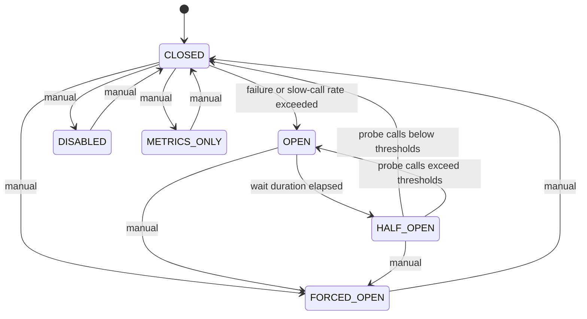

# Circuit Breaker

The **davilsx-resilience-circuitbreaker** module protects downstream services from cascading failures. It monitors call outcomes in a sliding window and temporarily blocks traffic when failure or slow-call thresholds are exceeded.

The design follows the same patterns as other davilsx-resilience components: DSL configuration, event-driven observability, and optional registry support. Behavior is aligned with [resilience4j CircuitBreaker](https://github.com/resilience4j/resilience4j/tree/master/resilience4j-circuitbreaker).

## Installation

Add the circuit breaker module to your Gradle dependencies:

```kotlin
dependencies {
    implementation("com.davils:davilsx-resilience-circuitbreaker:<version>")
}
```

All circuit breaker APIs are **suspend functions** and must be called from a coroutine.

## Quick start

```kotlin
import com.davils.resilience.circuitbreaker.circuitBreaker
import com.davils.resilience.circuitbreaker.exception.CallNotPermittedException
import kotlin.time.Duration.Companion.seconds

val cb = circuitBreaker {
    failureRateThreshold = 50f
    slidingWindowSize = 10
    minimumNumberOfCalls = 5
    waitDurationInOpenState(5.seconds)
}

try {
    val result = cb.execute { remoteService.fetch() }
    println(result)
} catch (e: CallNotPermittedException) {
    println("Circuit is ${e.state} — call blocked")
}
```

## State machine

The circuit breaker uses a finite state machine. The normal lifecycle is:

```
CLOSED → OPEN → HALF_OPEN → CLOSED
```

| State | Calls allowed? | Metrics collected? | Typical use |
|-------|----------------|-------------------|-------------|
| `CLOSED` | Yes | Yes | Normal operation |
| `OPEN` | No | Frozen snapshot | Protect downstream after threshold breach |
| `HALF_OPEN` | Limited probes | Yes (probe window) | Test whether the service recovered |
| `DISABLED` | Yes | No | Temporarily bypass protection |
| `FORCED_OPEN` | No | No | Manual kill switch |
| `METRICS_ONLY` | Yes | Yes (no enforcement) | Observe without blocking |



### How a call flows through `execute`

1. **Acquire permission** — rejected immediately when `OPEN` or `FORCED_OPEN`
2. **Run the block** — duration measured with a monotonic clock
3. **Classify the outcome** — success, error, slow success, slow error, or ignored
4. **Update the sliding window** — evaluate thresholds; transition if needed
5. **Emit events** — success, error, state transition, threshold exceeded, etc.

## Core concepts

### Sliding window

Call outcomes are aggregated in a sliding window before failure and slow-call rates are evaluated:

- **COUNT_BASED** — ring buffer of the last *N* calls (`slidingWindowSize`)
- **TIME_BASED** — all calls within the last *N* seconds

Thresholds are only evaluated after `minimumNumberOfCalls` have been recorded.

### Failure vs. slow-call rate

Two independent thresholds can open the circuit:

- **Failure rate** — percentage of failed calls in the window
- **Slow-call rate** — percentage of calls slower than `slowCallDurationThreshold`

Either threshold exceeding its configured limit triggers a transition to `OPEN`.

### Predicates

You can fine-tune what counts as a failure:

- `recordException` — which exceptions are failures (default: all)
- `ignoreException` — which exceptions are ignored (takes precedence over record)
- `recordResult` — treat specific successful return values as failures

### Wait interval

While `OPEN`, the circuit waits before allowing probe calls. Use a fixed duration or an exponential strategy that grows with consecutive open attempts.

## Documentation map

| Topic | Audience | Content |
|-------|----------|---------|
| [Configuration](Circuit-Breaker-Configuration.md) | Users | DSL settings, defaults, validation |
| [API reference](Circuit-Breaker-API.md) | Users | Runtime operations, events, metrics, registry |
| [Examples](Circuit-Breaker-Examples.md) | Users | Practical recipes and patterns |
| [Internals](Circuit-Breaker-Internals.md) | Developers | Architecture, components, concurrency |

## Runnable demo

See `davilsx-resilience-example/example-circuitbreaker` for a full demo with event logging, state transitions, and exponential wait intervals.
